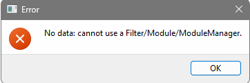
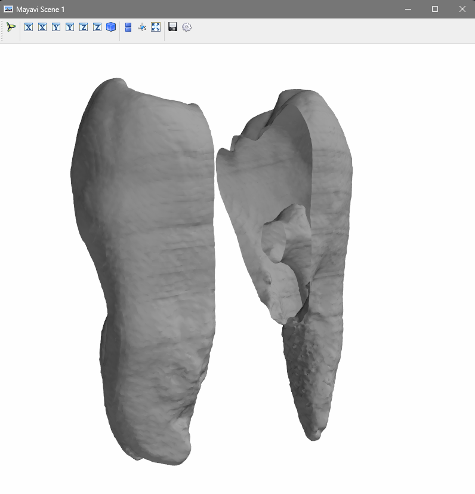
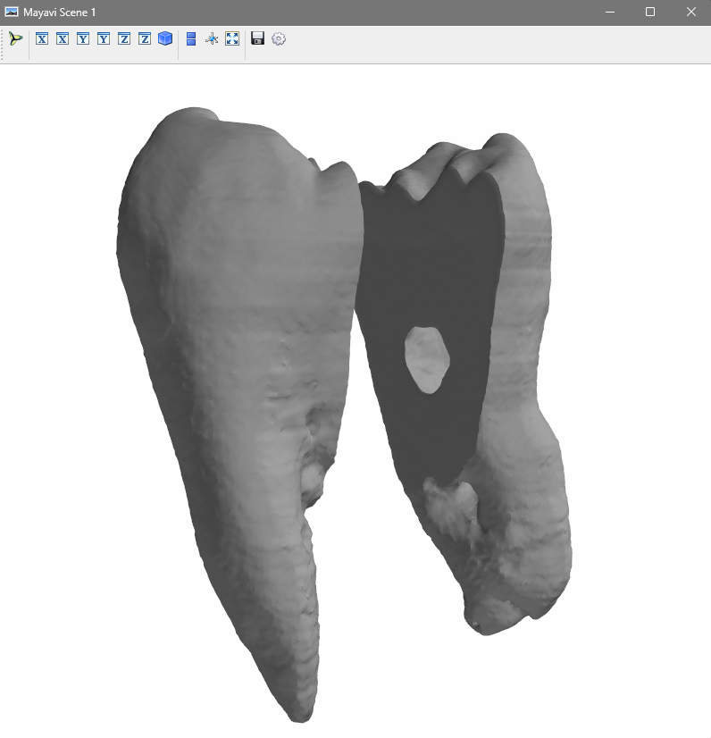
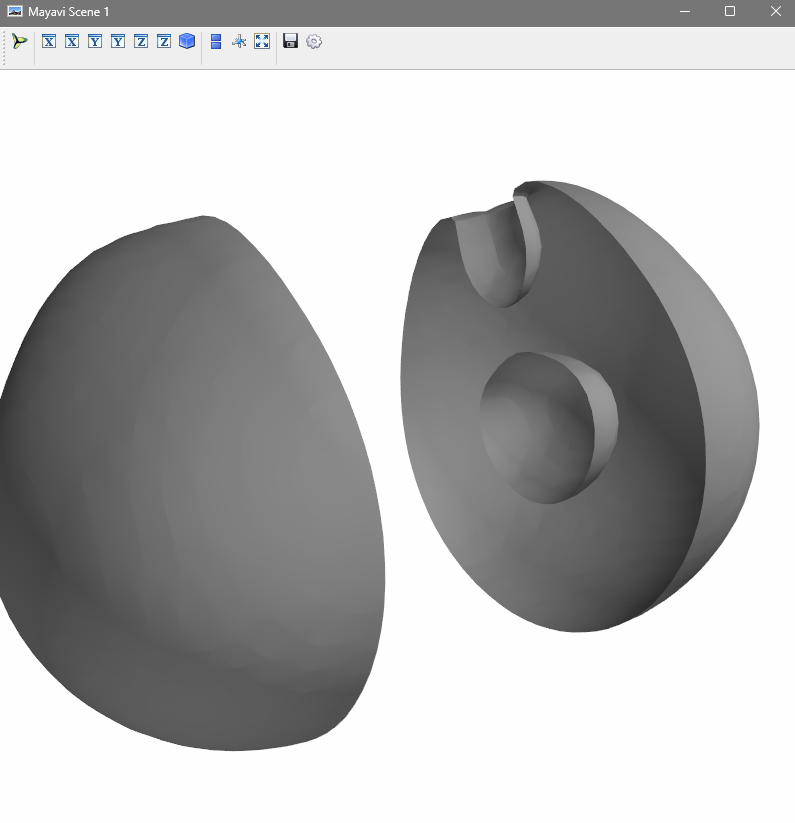
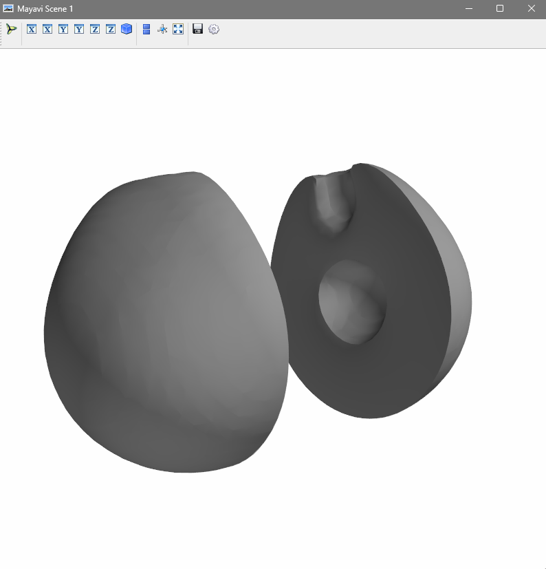

# CS453 Term Project
Authors: Nina Sanchez, Katie Kimura

Two data visualizations of a tooth and nucleon with one slice on the z-axis so the interiors of the 3D masses can be viewed.

# How to Run 
## Prerequisites: 
1. Have Python installed (version 3.11.9)
2. Have pip installed (version 24.3.1)
## Environment Setup
1. Clone this repo with `git clone https://github.com/nina-sanchez/CS453.git`
2. Install dependencies from requirements.txt with `pip install requirements.txt`
## Program Execution
1. You will need to run the `nucelon.py` and `tooth.py` files by first navigating to their respective directories and using the commands `python3 nucelon.py` and `python3 tooth.py`
2. A new window will open but you may receive one or two error windows and/or command line outputs that state: "No data: cannot use Filter/Module/ModuleManager." Just press "OK" on any modals that popup as they can be ignored

3. The data visualization should then display
   

